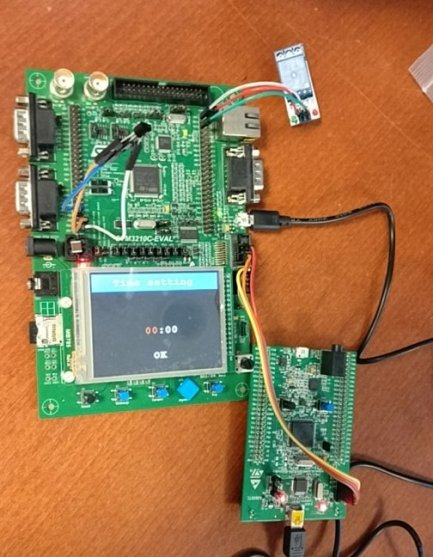
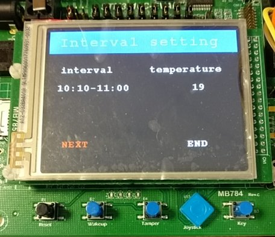
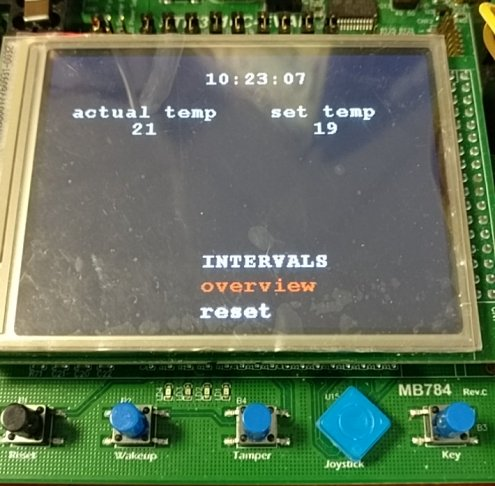

# Overview
This project builds into firmware for [STM3210C Eval board](http://www.st.com/en/evaluation-tools/stm3210c-eval.html). It works as a simple heating - there is [DS18B20 temperature sensor](https://www.maximintegrated.com/en/products/analog/sensors-and-sensor-interface/DS18B20.html) that periodically measures temperature.

There is a possibility for the user to set certain temperature for a time interval, and currently measured temperature is compared to this preset temperature. Depending on result of that comparison, the relay that should be connected to a boiler is switched on or off.

In my other repository [STM server] there is a web server that this device communicates with.
STM3210C-Eval board periodically sends temperature and synchronizes its interval settings with server.

Project is written in C++ and uses [HAL library](http://www.st.com/en/embedded-software/stm32cubef1.html).

**Documentation** is accessible through this [link](https://akirathan.github.io/STM32-smart-heating/)

## Description

This is screenshot of STM3210C-Eval board (on the left) and STM32F4-Discovery board (on the right).
Discovery board is used as a debugger because it embeds ST-link.
Relay module (in the top right corner) and temperature sensor (on the left) are connected to Eval board through GPIO pins.

This is the first frame that is displayed when Eval board is powered on.
User sets current time in this frame.
User can cycle through three windows (hours, minutes and ok button) with right/left joystick buttons, and set the value in the currently selected window with up/down joystick button.
Currently selected window is displayed in red color.

This frame lets user choose prefered temperature for a certain time interval.
NEXT button lets user input another interval.
Those informations (intervals and corresponding temperatures) are saved into device's EEPROM as soon as user hits END button.
Note that there is 64 KB of EEPROM in Eval board, so the number of intervals is almost unlimited (three 32 bit words per interval).
This frame is displayed after Time setting frame in case when no interval informations are available in EEPROM.

This is the main frame of the application. 
Three informations are displayed - current temperature (in `actual temp` window), temperature that was set for the current interval (in `set temp` window) and current time.
There are also two buttons - `overview` and `reset` that lets user overview or reset all the saved intervals.
When one of those buttons is pressed, "Interval setting" frame is displayed, and depending on which button was pressed, user can set time and temperature values or just cycle through interval with `NEXT` and `END` buttons.

# Requirements

## Hardware requirements
- [STM3210C Eval board](http://www.st.com/en/evaluation-tools/stm3210c-eval.html)
- [ST-LINK](http://www.st.com/en/development-tools/st-link-v2.html) as debugger
  - I use [STM32F4 Discovery Board]() for that purpose, because it contains st-link.
- [DS18B20 temperature sensor](https://www.maximintegrated.com/en/products/analog/sensors-and-sensor-interface/DS18B20.html)
- 5V relay

## Software requirements
- arm-none-eabi-gcc - Current version (6.3.1) is used.  
- openocd - Current version (0.9.0) is used.  
  - There is a config file stm3210c_eval.cfg for openocd. This file sets openocd to flash data through st-link debugger.
- All used libraries are included in this repository

For convenience there are .project and .cproject Eclipse CDT files included, there is also a launch file for Eclipse CDT (but you need ARM MCU plugin to use this launch file for debugging).

# Build

CMake is used as build system.
CMake files necessary for build can be found in `proj/cmake` directory.
For convenience there is located `config.bat` script.
Before running this script, you will most likely have to modify some options in `toolchain.cmake` or in `config.cmake`.
Running `config.bat` will create another script `build.bat` and running this will build whole project -
creating a new `build` directory and putting all the object files inside.

`flash.bat` can be used for flashing built firmware into STM3210C-Eval board.

# Directory structure

### src directory
`src` directory contains all sources neeeded to build the firmware.

`src/cube` contains mostly copied sources from CubeF1 library, with one exception - `src/cube/cube-mx`
which contains sources generated from CubeMX program (used for generating some peripheral-initializations
code).
There is also a CubeMX file `generic_eval.ioc` in `src/cube/cube-mx`.

`src/communication` contains all sources for communication with the web server.

`src/main/gui` contains all sources for firmwares GUI ie. all windows and frames.

`src/main/lwip_conf` contains configuration files for LwIP library.

`src/main/main` contains main application sources.

`src/main/hardware` contains low-level sources for example one_wire.

### lib directory
Contains cryptography libraries from STM.

### proj directory
Contains root CMake files and also Eclipse CDT project files.

# Architecture

Directly above hardware layer there are classes or namespaces that controlls the underlying hardware either directly or through HAL. 
For consistency purposes use of HAL is discouraged on places with appropriate controller.
Frames and windows (described in GUI section) are in the top most layer. Besides `IO` and `LCD` controllers, windows can use other controllers e.g. `StaticPresetTempWindow` uses `TempController` and `RTCController`.

## In details
First of all HAL is initialized and system clocks are initialized in `SystemClock_Config` function.
This function was copied from HAL project templates.
`ClkFrame` is then initialized and control is passed to it with `ClkFrame::passControl` method (refer to `IFrame::passControl` documentation for more information).
`ClkFrame` is a class that handles "Time setting" frame.
When user hits OK button, `ClkFrame::passControl` returns, time is retrieved and passed to `RTCController`.

`SetIntervalFrame` is initialized in case when `EEPROM` contains no interval data.
`SetIntervalFrame` class handles interval settings, and when user presses END button, `SetIntervalFrame::passControl` returns and finally `IntervalFrameData` (more specifically `std::vector<IntervalFrameData>`) can be retrieved.

`MainFrame` is then initialized.
It is the final frame of the application and control does not return from its `MainFrame::passControl` method.
`MainFrame` registers its static windows ( `StaticTimeWindow` and two `StaticTempWindow`s) for interrupts to `RTCController` (refer to *interrupts* section below).
When *overview* or *reset* button is pushed, the three static windows are hidden (otherwise they would redraw themselves on every `callback` from `RTCController`) and `OverviewIntervalFrame` or `SetIntervalFrame` is initialized.

### GUI
The only GUI elements are windows that are used to display a text information.
They are divided into two categories: static and control. 
Static windows just displays some information whereas control windows can be focused (by pressing right/left joystick buttons) and the values they store can be changed (by pressing up/down joystick buttons).
There is just one focused window at a time and its content is displayed in different (red) color.

Every control window should inherit from `IControlWindow` and implement `eventHandler` method accordingly.
The functionality of `eventHandler` is straightforward: control window returns `Message` telling whether the focuse should be put onto left or right neighbor window, or the whole frame should be shut down.

**Frames**
The term Frame stands for a display view i.e. what is displayed in current time. 
It is basically just a container that holds windows and is responsible for their displaying.
There is no restriction on controlling the windows, however there is a prefered way - to initialize all the windows and pass them to `WindowSystem` that reads user input and cycles through the windows accordingly until `Message::EXIT` is returned from one of the windows.
One can then simply investigate windows' values and end the whole frame.

### (Second) interrupts
Class can get (second or minute) notifications (implemented as interrupts) if it implements `ISecCallback` or `IMinCallback` interface. 
Implementation of one of those interfaces forces the implementer to register the class for (second or minute) callbacks to `RTCController`.
